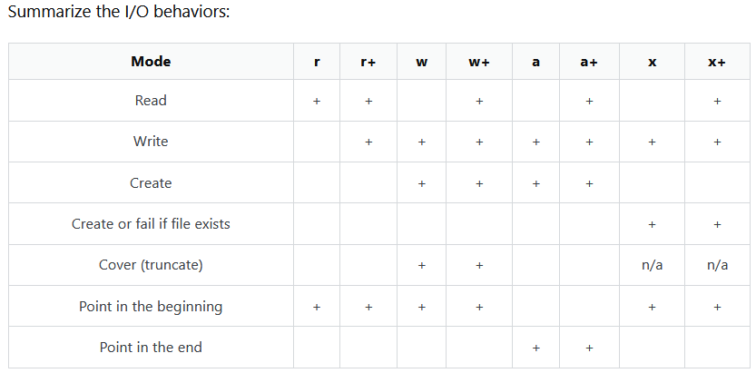

Pentru crearea unui enviroment folosim
https://www.youtube.com/watch?v=6B45foJRpJA
python -m venv "denumirea mediului fara ghilimele"
"denumirea mediului fara ghilimele"\Scripts\activate
Dupa instalam librariile necesare
pip install customtkinter

Inheritance Phyton
https://www.geeksforgeeks.org/python/inheritance-in-python/

Decision scheme for file use

